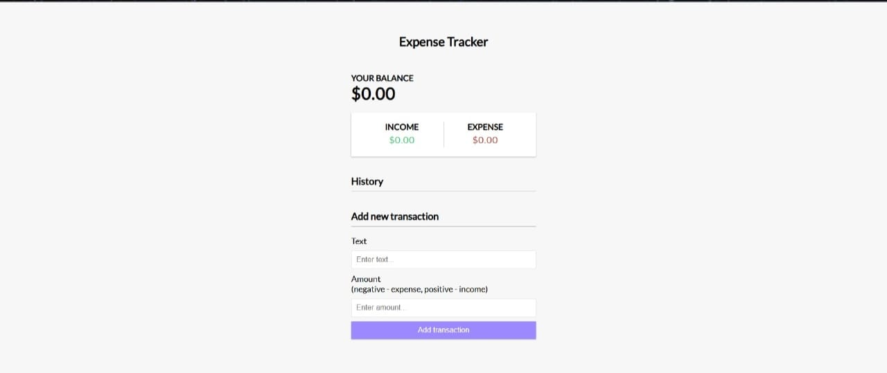

# 💰 Expense Tracker 📊

A clean and simple Expense Tracker web app built using HTML, CSS, and JavaScript. This tool helps you monitor your income and expenses with a live balance tracker and interactive UI.

---

## 🖥️ Demo

**App Preview**

---

## 🚀 Live Demo

Check out the app live at:  
🔗 [Live Demo - Expense Tracker](https://majestic-maamoul-7fcc48.netlify.app)

---

## ✨ Features

- 📥 Add income and expenses  
- 📤 Delete transactions  
- 🔄 Live balance and summary updates  
- 📱 Responsive design  
- 🧹 Reset and clean UI  
- ✅ Simple form validation

---

## 📂 Folder Structure

├── index.html
├── style.css
├── script.js
├── expense-tracker.jpg
└── README.md

---

## 🛠️ Tech Stack

- 💻 HTML5  
- 🎨 CSS3  
- ⚙️ JavaScript (DOM)

---

## 💡 Future Enhancements

- 📅 Filter by date or category  
- 📊 Visual graphs for expenses  
- 💾 Store data using LocalStorage or a backend  
- 🔔 Sound alerts on transaction

---

## 👩‍💻 About Me

### Ganta Jigeesha

🎓 3rd Year CSE Student @ VVIT, Guntur  
💻 Full Stack Developer | Java, React, PostgreSQL  
☁️ Completed Cloud Internships through Eduskills & AICTE  
🌱 Currently exploring Spring Boot & REST APIs

---

## 📬 Contact

- 📧 Email: [gantajigeesha2005@gmail.com](mailto:gantajigeesha2005@gmail.com)  
- 🔗 LinkedIn: (https://www.linkedin.com/in/gantajigeesha/)

---

💡 *“Code. Learn. Build. Repeat.”*
